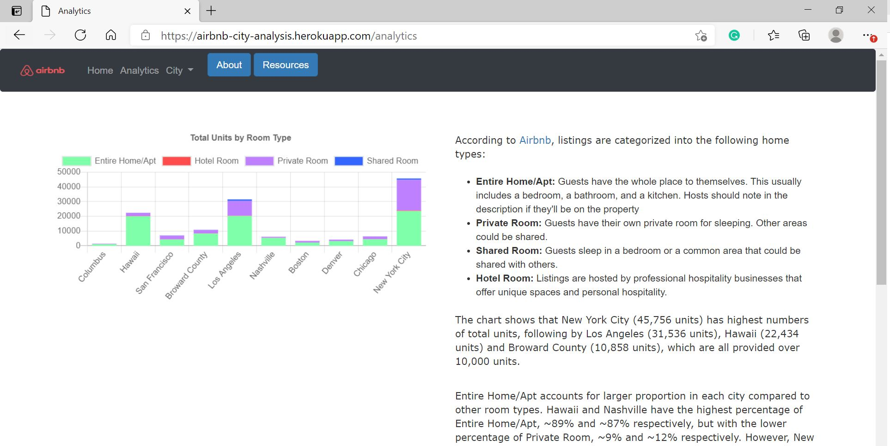

<!-- PROJECT LOGO -->
<br />
<p align="center">
  <a href="https://airbnb-city-analysis.herokuapp.com/">
    
  </a>
  <h3 align="center">Airbnb City Analysis</h3>
  <p align="center">
    <a href="https://airbnb-city-analysis.herokuapp.com/"><strong>Explore the Website »</strong></a>
  </p>
</p>

## About The Project
<a href="https://airbnb-city-analysis.herokuapp.com/">
  
</a>
<br>
<strong><i> The goal of this project is to create an interactive webpage for people who are interested in either staying or investing in Airbnb in chosen ten cities in the United States. The website provides insights and visualizations by using Inside Airbnb data. </i></strong>

## Prerequisites 
* Getting Started 
  ```
  git clone https://github.com/emmayianpan/Airbnb-Analysis.git
  ```
* Get [API Key at Mapbox](https://docs.mapbox.com/api/overview/) and input the token into `static/js/config.js` 
  ```
  const API_KEY = "YOUR API KEY"
  ```
  
## Built With
* [Python Pandas](https://pandas.pydata.org/) 
* [Python SQLAlchemy](https://www.sqlalchemy.org/) 
* [Python Requests](https://docs.python-requests.org/en/master/)
* [Python Beautiful Soup](https://pypi.org/project/beautifulsoup4/)
* [PyMongo](https://pymongo.readthedocs.io/en/stable/)
* [MongoDB](https://www.mongodb.com/2)
* [PostgreSQL](https://www.postgresql.org/) 
* [JavaScript Plotly](https://plotly.com/javascript/) 
* [JavaScript Leaflet](https://leafletjs.com/)
* [JavaScript Chart](https://www.chartjs.org/) 
* [JavaScript D3](https://d3js.org/) 
* [HTML](https://www.w3schools.com/html/)
* [CSS](https://www.w3schools.com/css/)
* [Bootstrap](https://getbootstrap.com/)
* [Python Flask](https://flask.palletsprojects.com/en/1.1.x/) 
* [Heroku](https://www.heroku.com/)

## Data Sources
* [Inside Airbnb](http://insideairbnb.com/)

## Cities
* San Francisco, California, United States (sf)
* New York City, New York, United States (nyc)
* Los Angeles, California, United States(la)
* Jersey City, New Jersey, United States (jc)
* Austin, Texas, United States (atx)
* Boston, Massachusetts, United States (bos)
* Nashville, Tennessee, United States (nsh)
* Chicago, Illinois, United States (chi)
* Columbus, Ohio, United States (colo)
* Denver, Colorado, United States (den)

## Data Visualization 
The website is presented with the visulization of: 
* Total Units by Room Type 
* Average Price/Total Supply by City 
* Top 25 Expensive Neighbourhood for each city 
* Top 5 Expensive Neighbourhood for each city (Boxplot)
* Airbnb Units Location and Information

## Created by 
Radhi Patel
* [GitHub](https://github.com/radhi630)

Yi An Pan (Emma)
* [Linkedin](https://www.linkedin.com/in/emmayianpan/) 
* [GitHub](https://github.com/emmayianpan)
